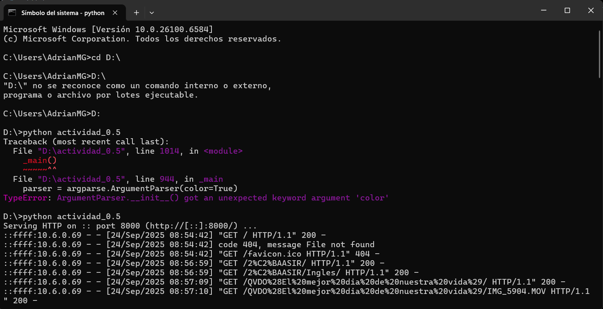
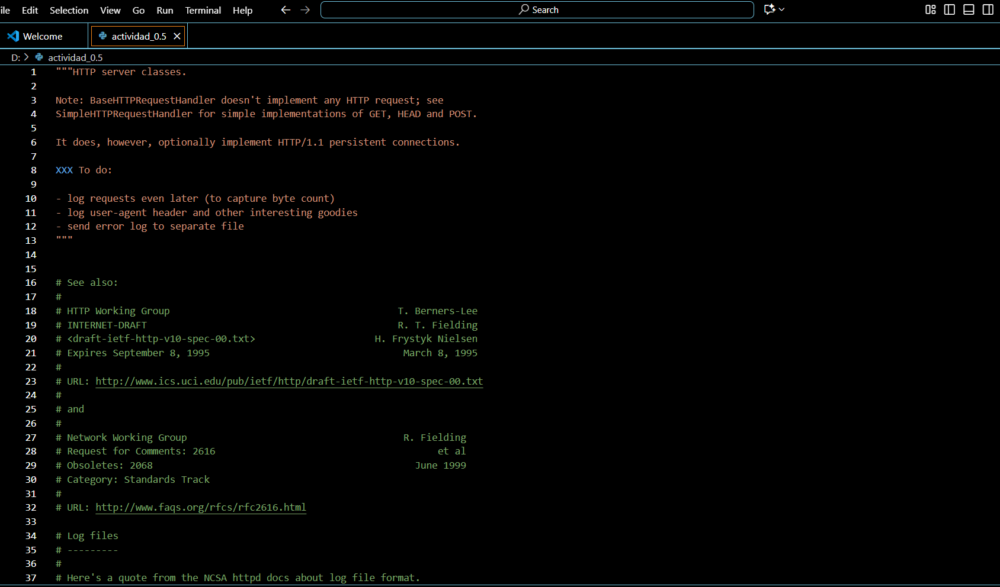
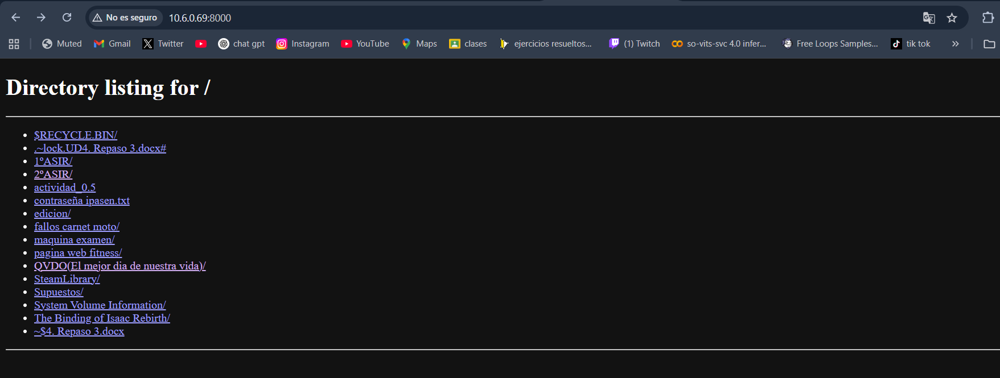

# SREI

Actividad 0.5 - Práctica servidor web
Visita los siguientes enlaces:
Simple web server (ejemplo 1)
https://docs.python.org/3/library/http.server.html
python -m http.server 8000
http server (ejemplo 2)
https://github.com/python/cpython/blob/main/Lib/http/server.py
dummy web server (ejemplo 3)
https://gist.github.com/kabinpokhrel/6fd1275603e9d5f1e284be717cbd1bff

Instala Python.

Ejecuta los ejemplos mostrados con anterioridad.

Publica en GitHub los ejemplos llevados a cabo. Los ejemplos se acompañaran con capturas de pantalla en las que se muestre su funcionamiento.

